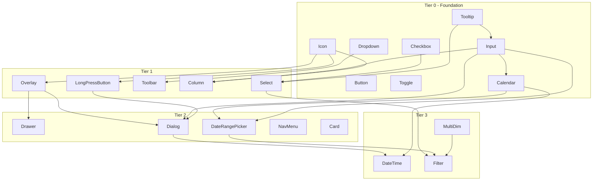

# Update plan sequence from Angular component dependencies

## Dependency map (from ngx-ui module `imports`)

Data was collected from each component’s `*.module.ts` under [projects/swimlane/ngx-ui/src/lib/components/](projects/swimlane/ngx-ui/src/lib/components/). Only **ngx-ui component module** dependencies are listed (Angular core, FormsModule, CDK, third-party like InViewport/Moment are omitted).

| Component                                                                                                                                                                                                    | Depends on (ngx-ui)                                                                |
| ------------------------------------------------------------------------------------------------------------------------------------------------------------------------------------------------------------ | ---------------------------------------------------------------------------------- |
| **Icon, Button, ButtonGroup, ButtonToggle, Checkbox, Toggle, Radiobutton, Slider, ProgressSpinner, Loading, Tooltip, Tabs, Split, Navbar, Notification, Hotkeys, CodeEditor, Tree, List, Dropdown, Stepper** | *(none)*                                                                           |
| **Overlay**                                                                                                                                                                                                  | Icon                                                                               |
| **Section**                                                                                                                                                                                                  | Icon                                                                               |
| **Input**                                                                                                                                                                                                    | Tooltip                                                                            |
| **Calendar**                                                                                                                                                                                                 | Input                                                                              |
| **LongPressButton**                                                                                                                                                                                          | Icon                                                                               |
| **Tip**                                                                                                                                                                                                      | Icon                                                                               |
| **TimeDisplay**                                                                                                                                                                                              | Tooltip, Icon                                                                      |
| **Select**                                                                                                                                                                                                   | Tooltip, Checkbox                                                                  |
| **Card**                                                                                                                                                                                                     | Icon, Tooltip, Checkbox                                                            |
| **Column / Columns**                                                                                                                                                                                         | Column → Input, Icon                                                               |
| **Toolbar**                                                                                                                                                                                                  | Dropdown                                                                           |
| **NavMenu**                                                                                                                                                                                                  | Icon, Tooltip                                                                      |
| **Drawer**                                                                                                                                                                                                   | Overlay                                                                            |
| **Dialog**                                                                                                                                                                                                   | Overlay, Input, LongPressButton                                                    |
| **Dropzone**                                                                                                                                                                                                 | Button, Icon, Tooltip                                                              |
| **DateRangePicker**                                                                                                                                                                                          | Input, Dropdown, Button, Icon, Tooltip, Calendar                                   |
| **Nag**                                                                                                                                                                                                      | Toolbar, Icon                                                                      |
| **SelectionList** (multi-dimension)                                                                                                                                                                          | Checkbox, Tooltip                                                                  |
| **MultiDimensionSelection**                                                                                                                                                                                  | Input, SelectionList                                                               |
| **DateTime**                                                                                                                                                                                                 | Input, Dialog, Calendar, Toggle, Tooltip, Icon                                     |
| **Filter**                                                                                                                                                                                                   | Select, Dropdown, DateRangePicker, MultiDimensionSelection, Tooltip                |
| **JsonEditor**                                                                                                                                                                                               | Checkbox, Input, Button, CodeEditor, Tooltip, Dropdown, Icon, Toggle, Select, Tabs |
| **PlusMenu**                                                                                                                                                                                                 | Icon, Hotkeys, Tooltip                                                             |

Key dependency chains:

- **Dialog → Overlay, Input, LongPressButton** → Overlay → Icon.
- **DateTime → Dialog**, so Dialog before DateTime.
- **DateRangePicker → Calendar**, so Calendar before DateRangePicker.
- **Filter → Select, DateRangePicker, MultiDimensionSelection** (and SelectionList).
- **JsonEditor** depends on the most components (Checkbox, Input, Button, CodeEditor, Tooltip, Dropdown, Icon, Toggle, Select, Tabs).

---

## Change to make in the plan

**File:** [.cursor/plans/ngx-ui_to_lit-ui_gap_48f80f46.plan.md](.cursor/plans/ngx-ui_to_lit-ui_gap_48f80f46.plan.md)

**Section to replace:** “## 2. Suggested order for implementation” (current bullets 1–6).

**New section content:** Replace that section with a dependency-ordered sequence and a short note on how it was derived. Suggested text:

---

## 2. Suggested order for implementation (dependency-aware)

Order is derived from ngx-ui component **module imports**: each component is listed after the ngx-ui components it depends on. This avoids building lit components that conceptually depend on others not yet implemented.

1. **Foundation (no ngx-ui component deps):** Icon, Tooltip, Loading, Progress spinner, Button, Button group, Button toggle, Checkbox, Toggle, Radiobutton, Slider, Dropdown, Tabs, Split, Stepper, Navbar, Notification, Hotkeys, Code editor, Tree, List.
  *Implement Icon and Tooltip first; they are used by the most other components.*
2. **Tier 1 (deps only on foundation):** Overlay (Icon), Input (Tooltip), Calendar (Input), Long-press button (Icon), Section (Icon), Tip (Icon), Select (Tooltip, Checkbox), Toolbar (Dropdown), Nav menu (Icon, Tooltip), Column / Columns (Input, Icon).
3. **Tier 2 (overlay stack + layout):** Drawer (Overlay), Dialog (Overlay, Input, Long-press button), Card (Icon, Tooltip, Checkbox), Time display (Tooltip, Icon), Dropzone (Button, Icon, Tooltip), Date range calendar (Input, Dropdown, Button, Icon, Tooltip, Calendar), Nag (Toolbar, Icon).
  *Overlay before Drawer and Dialog; Dialog before DateTime.*
4. **Tier 3 (forms + data):** Date-time (Input, Dialog, Calendar, Toggle, Tooltip, Icon), Multi-dimension selection (Input, Checkbox, Tooltip via SelectionList), Filter (Select, Dropdown, Date range, Multi-dimension selection, Tooltip).
5. **Tier 4 (highest dependents):** JSON editor (Checkbox, Input, Button, Code editor, Tooltip, Dropdown, Icon, Toggle, Select, Tabs), Plus menu (Icon, Hotkeys, Tooltip).
  *Plus menu and JSON editor are not prioritized in lit; implement last if at all.*

Continue updating the **Implemented** column to **Yes** as each component is completed in lit-ui.

---

## Summary

- **Source of truth:** Each `NgModule` in `projects/swimlane/ngx-ui/src/lib/components/<name>/*.module.ts` and its `imports` array.
- **No edits** to the checklist table (Section 1) or to the “Implemented” column semantics—only Section 2 (suggested order) is updated to match actual Angular component dependencies so the sequence is safe to follow when porting to lit-ui.

