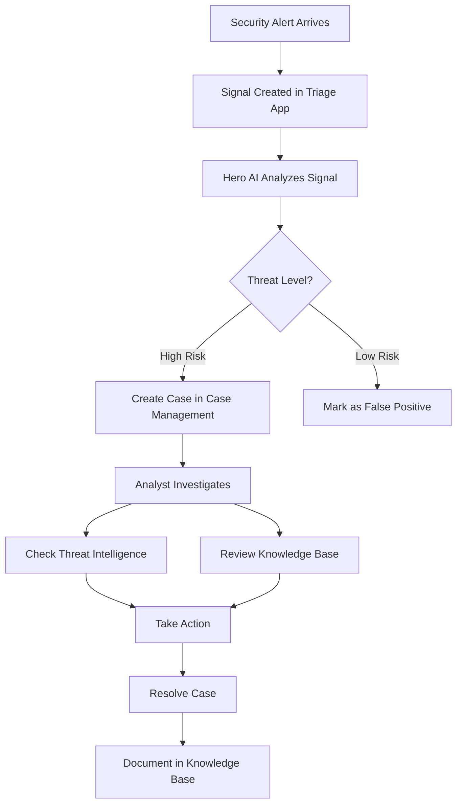
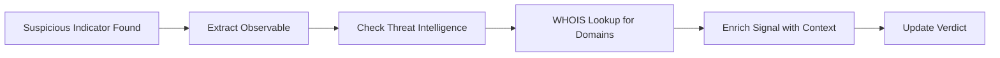

# Swimlane Turbine AI SOC Platform - Application Analysis

## Overview

**Swimlane Turbine** is a **low-code security automation platform** designed to help security operations centers (SOCs) respond to threats faster and more efficiently. Think of it as a smart assistant for cybersecurity teams that:

- **Automates repetitive security tasks** so analysts can focus on real threats
- **Connects different security tools** (like antivirus, firewalls, threat intelligence feeds) into one unified system
- **Analyzes security alerts** using AI to determine which ones are dangerous and which are false alarms
- **Tracks security incidents** from detection through resolution
- **Stores knowledge** about threats and how to respond to them

The platform goes beyond traditional SOAR (Security Orchestration, Automation, and Response) by capturing hard-to-reach security data and providing actionable insights across the entire security ecosystem.

---

## Available Applications (Datasets)

This Turbine instance has **4 main applications** that work together:

### 1. **Case Management**

- **Purpose**: Track security incidents and cases from start to finish
- **What it does**: Manages the lifecycle of security incidents, assigns priorities, tracks resolution status
- **Business value**: Ensures no security incident falls through the cracks

### 2. **Knowledge Base Articles**

- **Purpose**: Store institutional knowledge about threats, procedures, and solutions
- **What it does**: Acts as a library of "how-to" guides and threat information
- **Business value**: Helps analysts respond consistently and learn from past incidents

### 3. **Signal Triage (with Hero AI)**

- **Purpose**: Automatically analyze security alerts (signals) to determine if they're real threats
- **What it does**: Uses AI to evaluate alerts, correlate them with threat intelligence, and recommend actions
- **Business value**: Reduces alert fatigue by filtering out false positives

### 4. **Threat Intelligence Artifacts**

- **Purpose**: Store information about known threats (malicious IPs, domains, file hashes, etc.)
- **What it does**: Maintains a database of threat indicators that can be checked against incoming alerts
- **Business value**: Enables quick identification of known bad actors

---

## Key User Flows

### Flow 1: Security Alert Investigation

**Plain English**: When a security alert comes in, it's logged as a "signal." Hero AI automatically analyzes it by checking threat intelligence databases and similar past incidents. If it looks dangerous, a case is created for human analysts to investigate. They use the knowledge base and threat intelligence to understand the threat and take action. Once resolved, lessons learned are documented for future reference.

### Flow 2: Threat Intelligence Enrichment

**Plain English**: When something suspicious is found (like an IP address or domain), the system extracts it, looks it up in threat intelligence databases, performs additional research (like WHOIS lookups for domains), and adds all this context to help analysts make informed decisions.

---

## Key Modules and Features

### 1. **Signal Triage Module**

**What it does**:

- Receives security alerts from various sources
- Automatically analyzes them using Hero AI
- Assigns verdicts (Malicious, Suspicious, Benign)
- Correlates with similar past incidents
- Matches against predefined rules

**Business meaning**: This is the "first line of defense" that filters thousands of alerts down to the ones that actually need human attention.

### 2. **Case Management Module**

**What it does**:

- Creates and tracks security incident cases
- Assigns priorities (P1, P2, P3, etc.)
- Tracks status (Open, In Progress, Resolved, Closed)
- Links related signals and evidence
- Documents investigation steps

**Business meaning**: This is the "command center" where analysts manage their workload and ensure every incident is properly handled.

### 3. **Threat Intelligence Module**

**What it does**:

- Stores known malicious indicators (IPs, domains, file hashes, URLs)
- Provides context about threat actors and campaigns
- Enables quick lookups during investigations
- Integrates with external threat feeds

**Business meaning**: This is the "threat encyclopedia" that helps identify known bad actors instantly.

### 4. **Knowledge Base Module**

**What it does**:

- Stores articles about threats, procedures, and solutions
- Provides searchable documentation
- Captures lessons learned from past incidents
- Standardizes response procedures

**Business meaning**: This is the "institutional memory" that ensures consistent, informed responses.

---

## Available Components (Automation Tools)

These are pre-built automation tools that analysts can use:

### 1. **AI SOC - Match Rule**

- **Purpose**: Automatically check if a signal matches any predefined security rules
- **Example**: "Does this alert match our rule for detecting ransomware?"

### 2. **AI SOC - Signal Hero AI Analysis**

- **Purpose**: Use AI to analyze a signal and provide a verdict with confidence score
- **Example**: "Is this alert malicious? How confident are we?"

### 3. **AI SOC - Parse Observables**

- **Purpose**: Extract security indicators (IPs, domains, hashes) from text
- **Example**: Extract all IP addresses from an email body

### 4. **Ping Google**

- **Purpose**: Check network connectivity
- **Example**: "Is our internet connection working?"

### 5. **RST Cloud - WHOIS Lookup**

- **Purpose**: Look up domain registration information
- **Example**: "Who owns this suspicious domain?"

---

## Data Fields Reference

### Signal Triage Application Fields

| Field Name             | Purpose                                   | Required | Example Value                                           |
| ---------------------- | ----------------------------------------- | -------- | ------------------------------------------------------- |
| **Tracking ID**        | Unique identifier for the signal          | Yes      | SIG-12345                                               |
| **Evidence**           | Raw data about the alert                  | No       | JSON object with alert details                          |
| **AI Verdict**         | AI's determination of threat level        | No       | Malicious, Suspicious, Benign                           |
| **Confidence Score**   | How confident the AI is (0-100)           | No       | 85                                                      |
| **Analysis**           | Detailed explanation from AI              | No       | "This IP is associated with known malware campaigns..." |
| **Observables**        | Extracted indicators (IPs, domains, etc.) | No       | ["192.168.1.1", "evil.com"]                             |
| **Correlated Signals** | Similar past incidents                    | No       | [SIG-12340, SIG-12298]                                  |
| **Status**             | Current state of the signal               | Yes      | New, Analyzing, Triaged, Escalated                      |
| **Created Date**       | When the signal was created               | Yes      | 2,024-01-15 14:30:0                                     |

### Case Management Application Fields

| Field Name           | Purpose                           | Required | Example Value                                   |
| -------------------- | --------------------------------- | -------- | ----------------------------------------------- |
| **Tracking ID**      | Unique identifier for the case    | Yes      | CASE-789                                        |
| **Title**            | Brief description of the incident | Yes      | "Ransomware detected on finance server"         |
| **Priority**         | Urgency level                     | Yes      | P1 (Critical), P2 (High), P3 (Medium), P4 (Low) |
| **Status**           | Current state of the case         | Yes      | Open, In Progress, Resolved, Closed             |
| **Assigned To**      | Analyst responsible               | No       | john.doe@company.com                            |
| **Related Signals**  | Linked signal records             | No       | [SIG-12345, SIG-12346]                          |
| **Created Date**     | When the case was opened          | Yes      | 2,024-01-15 14:35:0                             |
| **Resolved Date**    | When the case was resolved        | No       | 2,024-01-15 18:20:0                             |
| **Description**      | Detailed incident information     | No       | "User reported encrypted files..."              |
| **Resolution Notes** | How the incident was resolved     | No       | "Isolated system, restored from backup..."      |

### Threat Intelligence Artifact Fields

| Field Name          | Purpose                          | Required | Example Value                         |
| ------------------- | -------------------------------- | -------- | ------------------------------------- |
| **Tracking ID**     | Unique identifier                | Yes      | TIA-456                               |
| **Indicator Type**  | Type of threat indicator         | Yes      | IP, Domain, Hash, URL, Email          |
| **Indicator Value** | The actual indicator             | Yes      | 192.168.1.100, evil.com, abc123def456 |
| **Verdict**         | Threat classification            | Yes      | Malicious, Suspicious, Benign         |
| **Threat Actor**    | Associated threat group          | No       | APT28, Lazarus Group                  |
| **Campaign**        | Related attack campaign          | No       | "Operation XYZ"                       |
| **First Seen**      | When first observed              | No       | 2,024-01-10                           |
| **Last Seen**       | Most recent observation          | No       | 2,024-01-15                           |
| **Confidence**      | Reliability of the intelligence  | No       | High, Medium, Low                     |
| **Source**          | Where the intelligence came from | No       | "VirusTotal", "Internal Analysis"     |
| **Tags**            | Categorization labels            | No       | ["ransomware", "phishing", "C2"]      |

### Knowledge Base Article Fields

| Field Name        | Purpose           | Required | Example Value                          |
| ----------------- | ----------------- | -------- | -------------------------------------- |
| **Tracking ID**   | Unique identifier | Yes      | KB-123                                 |
| **Title**         | Article title     | Yes      | "How to Respond to Phishing Incidents" |
| **Category**      | Type of article   | Yes      | Procedure, Threat Analysis, Tool Guide |
| **Content**       | Article body      | Yes      | Detailed text content                  |
| **Tags**          | Search keywords   | No       | ["phishing", "email", "response"]      |
| **Author**        | Who created it    | No       | jane.smith@company.com                 |
| **Created Date**  | When published    | Yes      | 2,024-01-01                            |
| **Last Updated**  | Most recent edit  | No       | 2,024-01-10                            |
| **Related Cases** | Linked incidents  | No       | [CASE-100, CASE-105]                   |

---

## Component/Tool API Mapping

### AI SOC - Match Rule

- **Action**: Evaluate signal against security rules
- **Input Parameters**:
  - **Tracking_ID** (optional): Signal tracking ID (e.g., "SIG-12345")
- **Purpose**: Automatically check if a signal matches predefined detection rules

### AI SOC - Signal Hero AI Analysis

- **Action**: Perform AI-powered threat analysis
- **Input Parameters**:
  - **SIG_Record_Tracking_ID** (optional): Signal tracking ID (e.g., "SIG-12345")
  - **Evidence** (optional): Additional evidence object
- **Purpose**: Analyze threat intelligence, knowledge base, and correlated signals to generate verdict and confidence score

### AI SOC - Parse Observables

- **Action**: Extract security indicators from text
- **Input Parameters**:
  - **text_value** (optional): Text to parse (e.g., email body, log entry)
- **Purpose**: Automatically identify and extract IPs, domains, hashes, URLs, and emails from unstructured text

### Ping Google

- **Action**: Network connectivity check
- **Input Parameters**: None
- **Purpose**: Verify internet connectivity and system health

### RST Cloud - WHOIS Lookup

- **Action**: Domain registration lookup
- **Input Parameters**:
  - **Domain** (optional): Domain name to look up (e.g., "example.com")
- **Purpose**: Retrieve domain ownership, registration date, registrar, and contact information for investigation

---

## How It All Works Together

**Imagine this scenario:**

1. **Alert arrives**: Your firewall detects suspicious traffic to an unknown domain
2. **Signal created**: Turbine automatically creates a signal record (SIG-12345)
3. **AI analysis**: Hero AI analyzes the signal:
   - Extracts the domain using "Parse Observables"
   - Looks up the domain in threat intelligence
   - Performs a WHOIS lookup to see who owns it
   - Checks knowledge base for similar past incidents
   - Matches against security rules
4. **Verdict assigned**: AI determines it's "Malicious" with 92% confidence
5. **Case created**: Because it's high-risk, a case (CASE-789) is automatically created with P1 priority
6. **Analyst investigates**: A security analyst reviews the case, sees all the AI analysis, and takes action (blocks the domain)
7. **Resolution**: Case is resolved and a knowledge base article is created documenting the threat
8. **Future protection**: Next time this domain appears, it's instantly recognized as malicious

This entire process, which might take hours manually, happens in seconds with Turbine's automation.

---

## Key Benefits

- **Speed**: Automate repetitive tasks and respond to threats in seconds
- **Accuracy**: AI reduces false positives and helps prioritize real threats
- **Consistency**: Standardized workflows ensure nothing is missed
- **Knowledge retention**: Institutional knowledge is captured and searchable
- **Integration**: Connects all your security tools into one platform
- **Scalability**: Handle thousands of alerts without adding more analysts

---

Is there a specific aspect of the platform you'd like me to explain in more detail?
